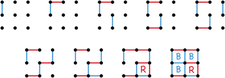
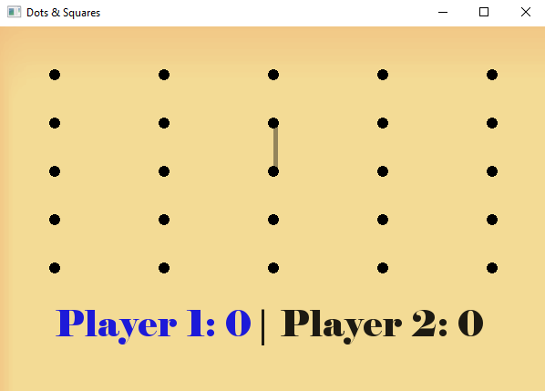
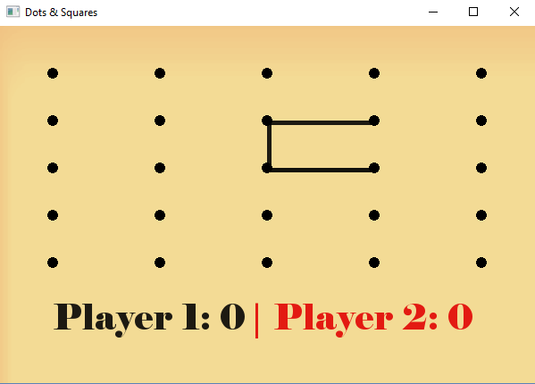
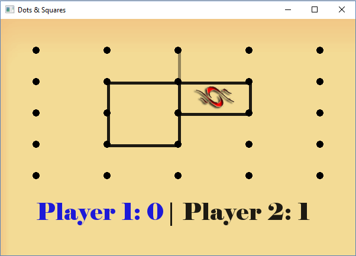
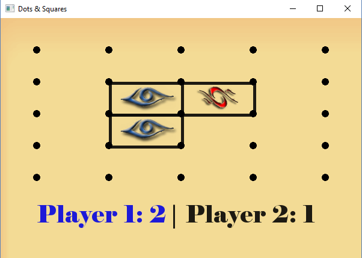

# [ITI] SFML-game - Boxes & Squares
Game Assignment using SFML

# Boxes & Squares

A two players’ game where each player takes a turn alternately to draw / put a line between any two dots among several in a grid.
Once a player closes a box, that player is allowed an extra turn.
The player who closes (Marks) more boxes than the other wins! 

  

## Implementation using SFML:
-	Vertical and horizontal line spaces are drawn separately (due to difference in number).
-	Grid size is 5X5 (dots).
-	A dim line appears when hovering between any two points.
-	A player is allowed to close two squares at the same time with one move if the chance allows it.
-	Players’ scores are maintained at the bottom of the game’s screen.

<pre>

</pre>

 	 
